#  常用命令

## cd命令

更改目录

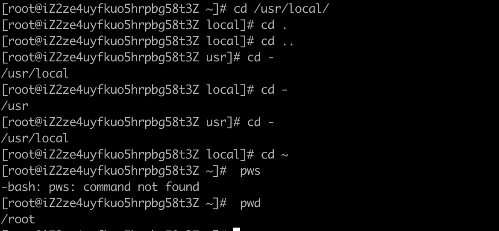

## ls命令

显示文件

```shell
# 查看ls命令
ls --help
```

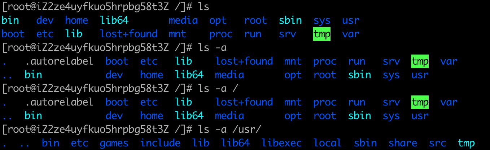

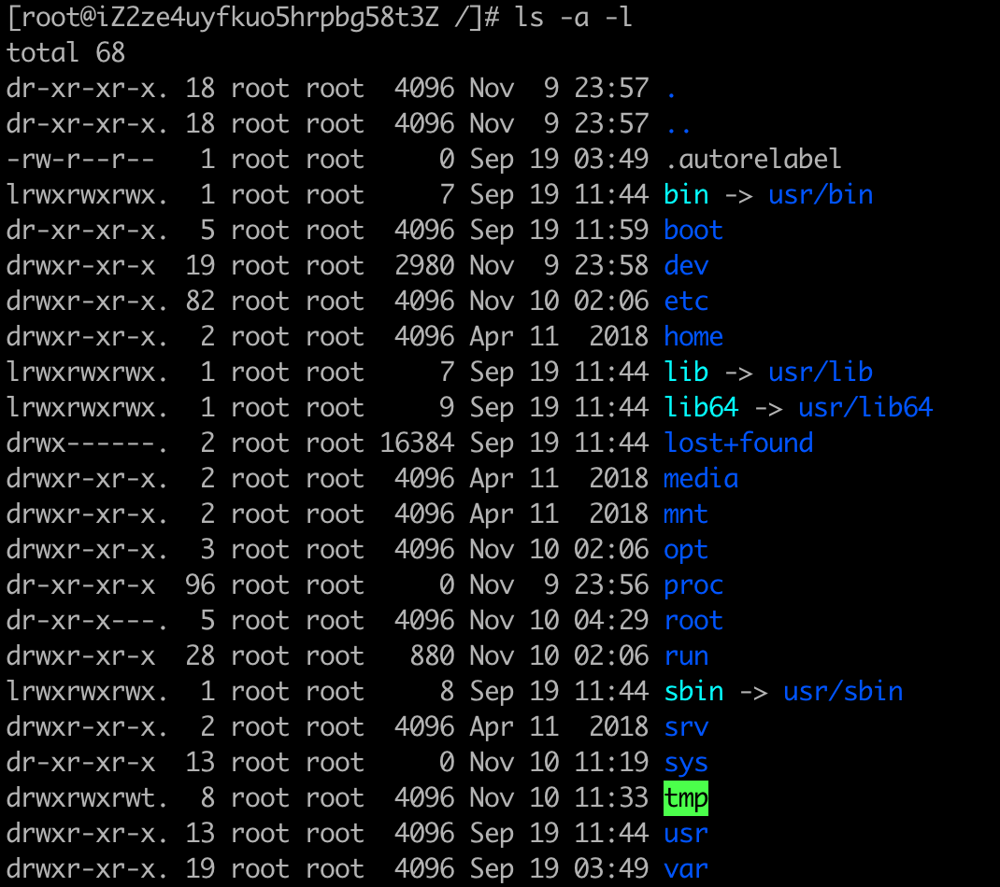

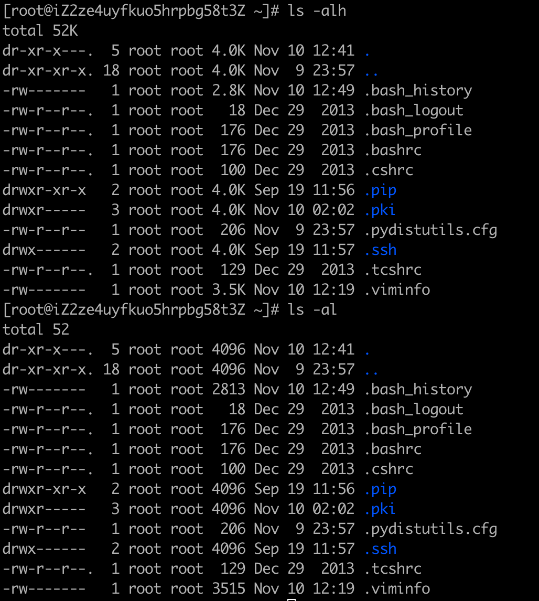

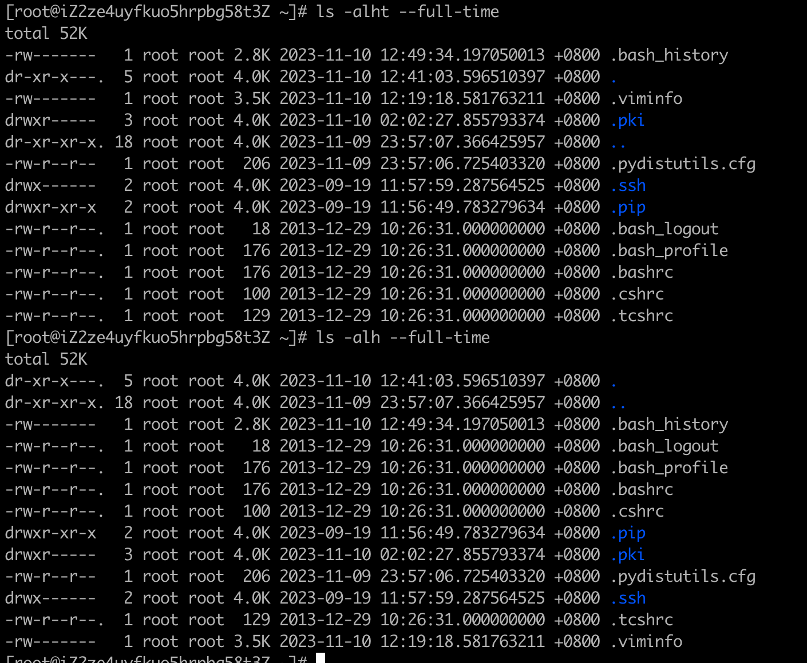

## whoami命令

查看当前登录用户

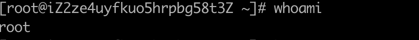

## su命令

切换用户

```shell
su - username
```

## logout命令

退出当前用户

```shell
logout
```

## hostname命令

查看当前主机名

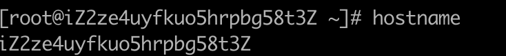

## pwd命令

当前所在的工作目录

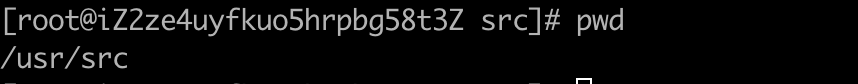

## date命令


## mkdir命令

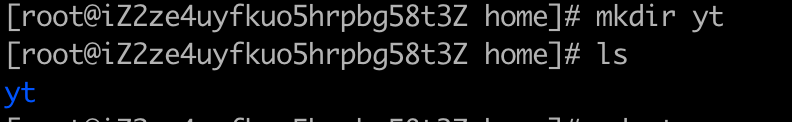

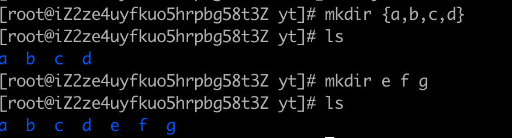

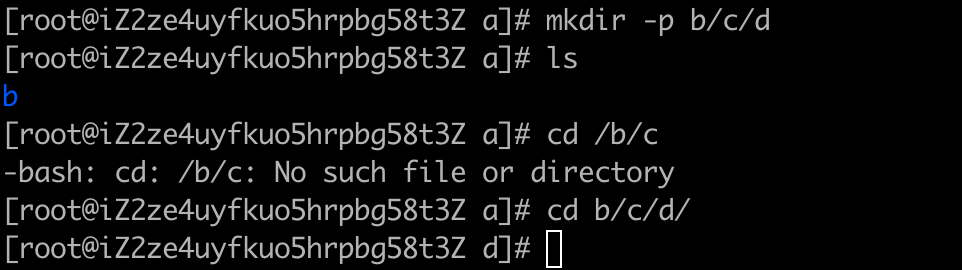

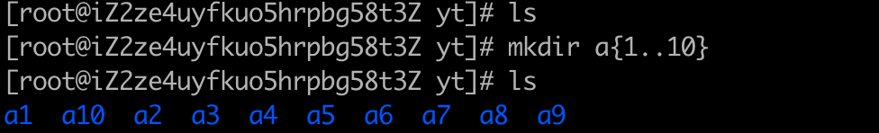

## touch命令

1. 创建文件

   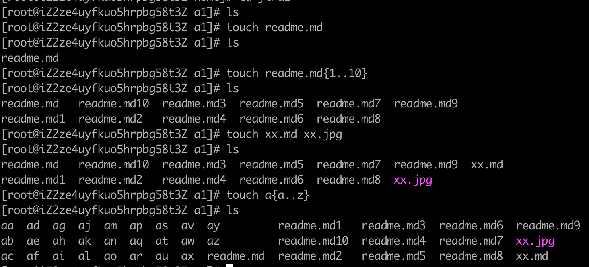

2. 修改文件时间

   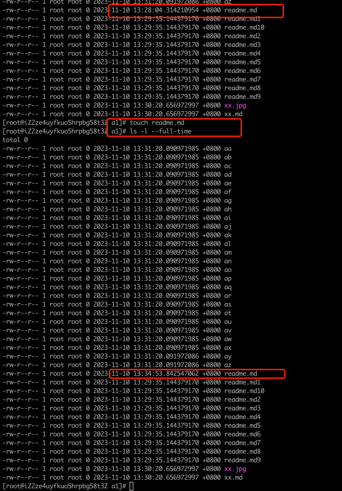

## cp命令

```shell
用法
	1. cp [选项] [-T] 源文件 目标文件
	2. cp [选项] 源文件 目录
	3. cp [选项] -t 目录 源文件

-r 递归式复制目录, 即复制目录下的所有层级的子目录及文件 -p 复制的时候, 保持属性不变
-d 复制的时候保 持软连接
-a 等于-pdr
-p 等于--preserve=模式, 所有权, 时间戳, 复制文件时保持源文件的权限,时间属性
-i --interactive 覆盖前询问提示
```

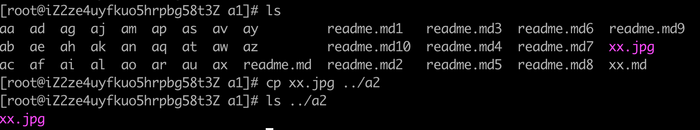

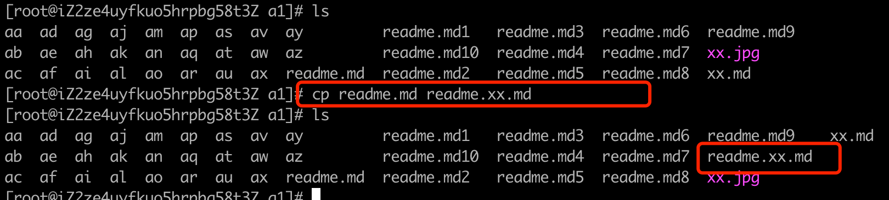

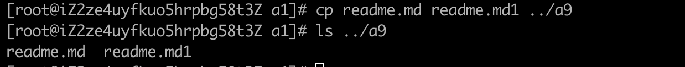

## mv命令

```shell
mv命令作用是移动或是重命名文件
用法
	1. mv [选项] [-T] 源文件 目标文件
	2. mv [选项] 源文件 目录
	3. mv [选项] -t 目录 源文件
将源文件重命名为目标文件, 或将源文件移动至指定目录
-f --force 				覆盖前不移动
-i --interactive 	覆盖询问
```

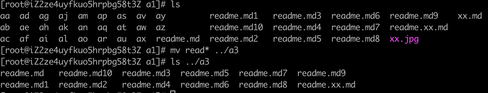

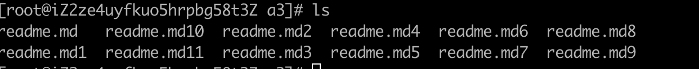

## rm命令

```shell
rm命令作用就是删除一个或多个文件
-f --force 强制删除, 忽略不存在的文件, 不提示确认
-i 在删除前需要确认
-I 在删除超过三个文件或者递归删除前要求确认
-d --dir 删除空目录
-r -R --recursive 递归删除目录及内容
-v --verbose 详细显示进行的步骤
```


## alias命令

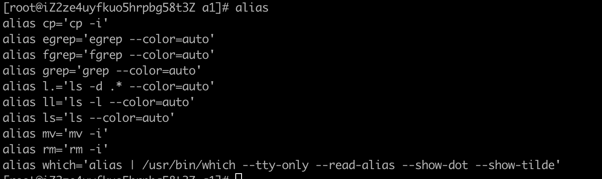
